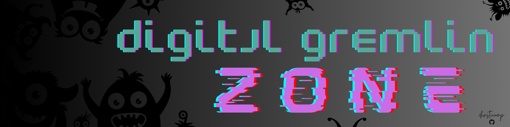
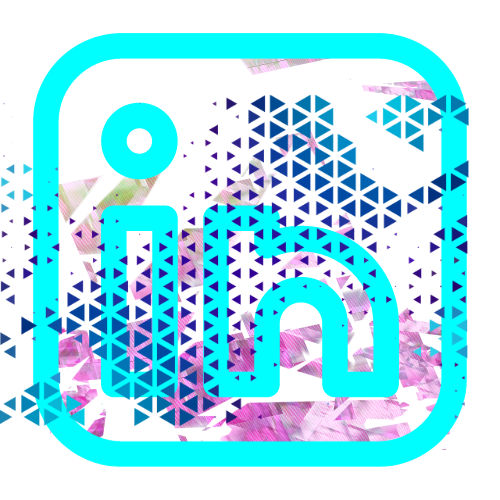
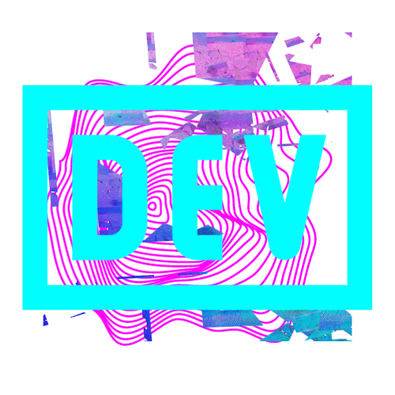
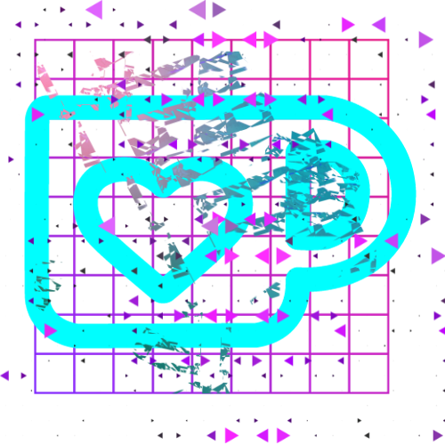
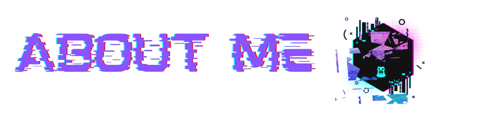
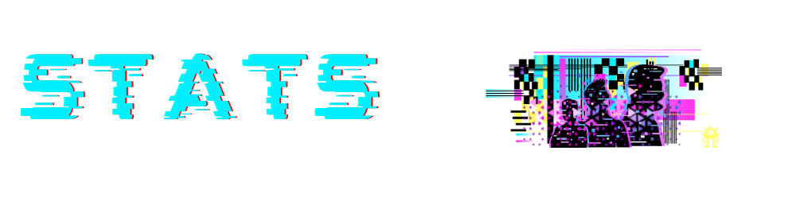
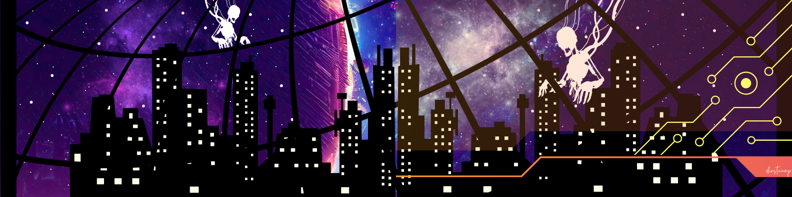
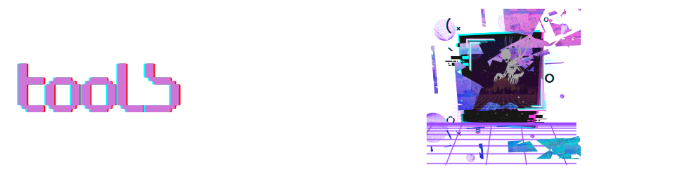
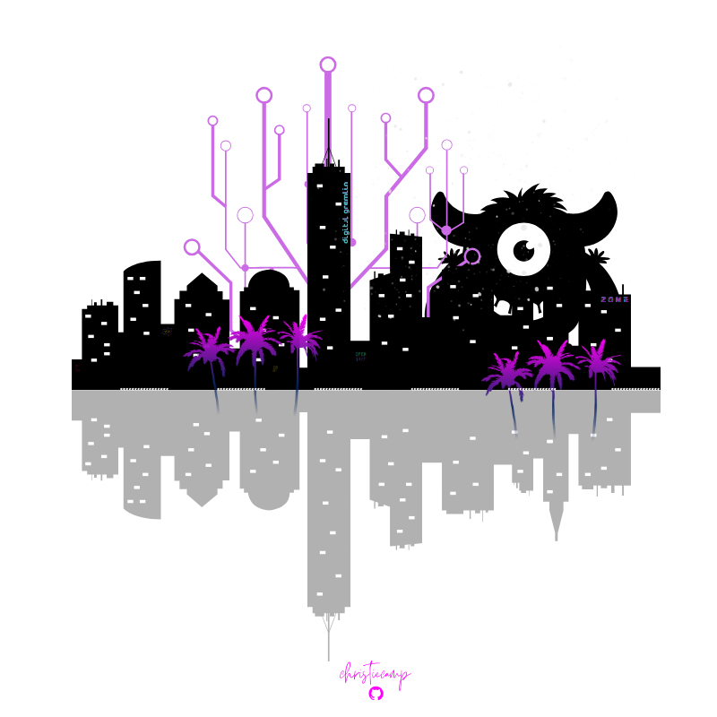

<p align="right">
  
</p>

<p align="center">
  
</p>

<p align="center">
  <a href="https://www.linkedin.com/in/christiecamphoto/"></a>
  &#8287;&#8287;&#8287;&#8287;&#8287;
  <a href="https://dev.to/christiecamp"></a>
  &#8287;&#8287;&#8287;&#8287;&#8287;
  <a href="https://ko-fi.com/christiecamp"></a>
</p>

<p align="center">
  
</p>

#

### 

```javascript
const christiecamp = {
     location: 'Richmond VA',
     education: 
      [
        'BFA Photography & Film',
        'Full-Stack Web Dev Bootcamp',
      ],
     interests: 
      [
        'Graphic Design', 
        'Marketing', 
        'Web Development', 
        'UI/UX', 
        'Game Development', 
        'DevOps'
      ],
    hobbies: ['gaming', 'hiking', 'reading', 'creating'],
    current_projects: 
      [
        'GREMLIN LAND - React Portfolio',
        'SNAKE FEST - Mini Pygame'
      ],
    recent_project: 'TINY TRINKETS - Redux Store',
    learning: 'Python',

    2023: 'created/branded 20 projects & grasped 5 new technologies',
    2024 Goals: '4 new languages - Python, C, C++, Ruby'
};
```

#

### 

##### STREAK STATS 🤖


##### PROFILE STATS 👤
 


##### CONTRIBUTION STATS 👥


#



### 

<!-- languages -->

##### LANGUAGES  ✍️


<!-- frameworks -->

##### FRAMEWORKS 🧮


<!-- databases -->

##### DATABASES 📈


<!-- hosting -->

##### HOSTING 💭


<!-- software -->

##### SOFTWARE 💾


<!-- testing -->

##### TESTING 🔬


#

<p align="center">
<a href="https://www.christiecamp.com"></a>
</p>

