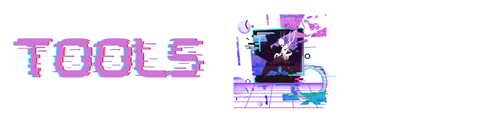

<p align="right">
  
</p> 

<p align="right">
  
</p>


<p align="center">
  
</p>

<p align="center">
  <a href="https://www.linkedin.com/in/christiecamphoto/"></a>
  &#8287;&#8287;&#8287;&#8287;&#8287;
  <a href="https://dev.to/christiecamp"></a>
  &#8287;&#8287;&#8287;&#8287;&#8287;
  <a href="https://ko-fi.com/christiecamp"></a>

#

### 

```javascript
const christiecamp = {
     location: Richmond, VA,
     education: 
      [
        'B.F.A in Photography & Film',
        'Full-Stack Web Development Bootcamp',
      ],
     interests: 
      [
        'Graphic Design', 
        'Marketing', 
        'Web Development', 
        'UI/UX', 
        'Game Development', 
        'DevOps',
      ],
    hobbies: ['gaming', 'hiking', 'reading', 'creating'],
    learning: ['MongoDB'],
    current_project: [`AUTOPSY FILES - REGEX Gist`],
    recent_project: [`STROKE OF LUCK - CYOA game`],
    2023 Goals: [`create 20+ projects and learn 5 new technologies`],
};
```

#

### 

##### STREAK STATS 🤖


##### PROFILE STATS 👤

 


##### CONTRIBUTION STATS 👥


#
#
<br>


<br>
<!--  -->

#
#

### 

<!-- languages -->

##### LANGUAGES  ✍️


<!-- frameworks -->

##### FRAMEWORKS 🧮


<!-- databases -->

##### DATABASES 📈


<!-- software -->

##### SOFTWARE 💾


#

<p align="center">
<a href="https://www.christiecamp.com"></a>
</p>

