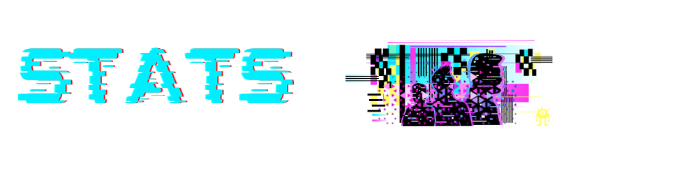

[](https://www.linkedin.com/in/christiecamphoto/)
[](https://christiecamp.com)
[](mailto:christiecamphoto@gmail.com)


#

### 

```javascript
const Christine_Campbell = {
     pronouns: "she" | "her",
     languages: [Javascript, HTML, CSS, JS],
     education: ["B.F.A in Photography & Film, Full-Stack Web Development Bootcamp"],
     interests: ["Graphic Design", "Marketing", "Web Development", "UI/UX", "Game Development", "DevOps"],
     hobbies: ["gaming", "hiking", "reading", "creating"],
     learning: ["Model-View Controller"],
     current_project: ["TBD - ORM application"],
     recent_project: ["WEREWOLF WEED Employee Database"],
};
```

#

### 

[](https://github.com/christiecamp)


<!--  -->

#

<p align="center">
  
</p>

<p align="center">
<a href="https://www.christiecamp.com"></a>
</p>

